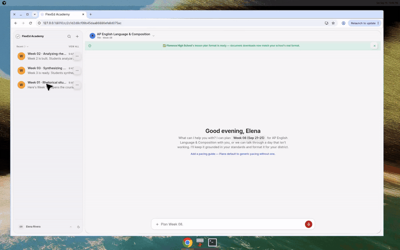

<div align="center">


# FlexEd Academy

**Standards-grounded AI lesson planning for high-school teachers.**

Turn a weekly request into a structured, standards-aligned lesson plan — with the source behind
every cited standard — and export it as a district-formatted Word document.

[](https://github.com/JoshuaColePhD/FlexedAcademy/actions/workflows/quality.yml)
[](https://github.com/JoshuaColePhD/FlexedAcademy/actions/workflows/security.yml)
[](https://github.com/JoshuaColePhD/FlexedAcademy/actions/workflows/uptime.yml)

[**Live product → flexedacademy.com**](https://flexedacademy.com) · [Case study](docs/recruiter/FlexedAcademy_Case_Study.md) · [Architecture](docs/ARCHITECTURE.md)

</div>

---

## Demo

Open a week, review the generated five-day plan and its **cited standards**, inspect the grounded
**sources**, and download the district-formatted **DOCX** — in light or dark mode.



<sub>Shown as a GIF because GitHub only embeds video players for files uploaded through its own UI. Full quality: [MP4](docs/recruiter/FlexedAcademy_Walkthrough.mp4) · [WebM](docs/recruiter/FlexedAcademy_Walkthrough.webm). On the live site, click **Explore demo (read-only)** — no setup required.</sub>

---

## What it does

| | |
| --- | --- |
| **Plans a full week** | Generates a five-day, standards-aligned plan from a teacher prompt and class context. |
| **Grounded in real standards** | Cites source documents — not model memory — with verbatim text and source metadata. |
| **Shows the sources** | Surfaces cited standards, provenance, and grounding warnings for review. |
| **Matches your district** | Renders school-specific lesson-plan templates and exports DOCX (and QTI for quizzes). |
| **Conversational** | Coaching, day-level revision, quiz generation, and teacher-owned pacing guides. |
| **Production-ready** | Multi-teacher auth, class scoping, usage entitlements, billing, and account controls. |

## Why this is an AI-engineering project

The hard problem isn't text generation — it's **trust**. Standards contain low-frequency codes,
repeated numbering schemes, and course-specific meanings that language models easily confuse.
FlexEd treats retrieval, validation, and refusal as first-class product behavior, so a plan can
prove where every cited standard came from:

```text
Teacher request
      ↓
Class / course / grade resolution
      ↓
Query expansion + embedding
      ↓
Course- and grade-scoped pgvector retrieval
      ↓
Relevance floor and scope checks     ──►  refuse rather than guess
      ↓
Grounded context supplied to the model
      ↓
Strict structured lesson-plan response (OpenAI Structured Outputs)
      ↓
Schema validation + citation grounding audit
      ↓
Postgres persistence + templated DOCX generation
```

## Engineering highlights

- **Retrieval-augmented generation** with source metadata, verbatim standard text, course/grade filters, query expansion, and measured relevance thresholds.
- **Layered grounding controls**: out-of-scope grade refusal, off-domain refusal, source-type-aware retrieval, and post-generation detection of missing, borrowed, or hallucinated standard codes.
- **Structured outputs**: strict JSON schemas so the frontend and document builders get a predictable contract instead of free-form model text.
- **Resilient streaming** over Server-Sent Events: reconnects, upstream timeouts, rate limits, model refusals, response truncation, token accounting, and database-backed completion caching.
- **Standards ingestion** from ALSDE CASE packages with PDF verification. The checked Alabama artifact holds 7,456 unique standards and 19,701 grade-scoped chunks across 11 frameworks at `--grades 0-12` (ingest defaults to 9–12); AP Language is the most thoroughly calibrated path.
- **Template-aware document pipeline** that validates plans before rendering, supports school-specific templates, and persists generated documents through a durable queue.
- **Tenant-aware platform**: authentication, class scoping, account export/deletion, session invalidation, plan-sharing controls, rate limiting, and security regression tests.

## Evaluation

The repository includes deterministic unit, contract, retrieval, grounding, security, and artifact
tests. The release retrieval gate is generated from the current corpus:

```text
Current recall@5:  61 / 61
Current recall@20: 61 / 61
```

<sub>The older 143-case set remains a historical drift diagnostic because many of its AP codes no longer exist in the current corpus.</sub>

The suite also covers cross-course and cross-class grounding isolation, off-domain refusal,
structured plan shape, grounded vs. non-retrieved vs. hallucinated citations, streaming reconnects,
DOCX integrity and queued document recovery, and security cases (account takeover, session
invalidation, public-plan access, SPA file exposure).

Run the fast local checks from the repository root:

```bash
./venv/bin/python eval/run_all.py --fast
./venv/bin/python scripts/05_eval_harness.py --offline   # no network required
```

The Alabama standards artifact has its own dependency-free quality gate — framework roster, required
metadata, valid state/grade scope, duplicate identities, source URLs, PDF verification, and report
consistency:

```bash
./venv/bin/python scripts/check_alabama_ingest.py
```

<details>
<summary>How embedding rebuilds stay safe</summary>

Embedding rebuilds keep a local content-addressed cache keyed by the embedding model, dimensions,
and document text, so interrupted or repeated rebuilds reuse unchanged vectors. The staged Supabase
cutover validates the complete replacement corpus before it becomes live: each rebuild uses a unique
staging identifier, builds HNSW/full-text indexes after loading, and only then performs the atomic
table swap — retries never write a partial live corpus.

</details>

## Tech stack

- **Backend** — Python 3.12, FastAPI, Pydantic, OpenAI API
- **Data** — Postgres / Supabase with `pgvector`
- **Frontend** — React, Vite, React Router, TanStack Query
- **Streaming** — Server-Sent Events for streamed generation
- **Documents** — `python-docx` and LibreOffice-compatible generation
- **Integrations** — Google OAuth & Drive, Stripe billing, Resend email, Sentry, Render
- **Interop** *(experimental, not yet in production)* — an in-progress MCP Streamable HTTP connector with OAuth 2.1/PKCE and an Apps SDK lesson-plan widget

## MCP / ChatGPT connection (experimental — not yet enabled in production)

> **Status:** work in progress. The pieces below exist in the codebase, but the connector is still
> being built and hardened and is **not turned on in production**. Treat this as a preview of
> intended functionality, not a shipped feature.

FlexEd includes an in-progress remote MCP server (`/mcp/`) that aims to let a compatible ChatGPT
custom app, Claude connector, or MCP client authenticate with OAuth discovery, approve access in the
teacher's FlexEd account, and then call the same retrieval → generation → grounding → database → DOCX
pipeline the web app uses. The planned Apps SDK surface covers class/week context, plan listing and
retrieval, plan generation, day-level revision, a secure DOCX capability URL, and an in-chat
lesson-plan widget.

For local experimentation, log in and `POST /api/mcp/token` for a short-lived per-user bearer token
and the MCP URL, and set `MCP_PUBLIC_URL` to the public HTTPS origin for a shared deployment. Never
commit `MCP_ACCESS_TOKEN`, `SESSION_SECRET`, or any generated connector token.

## Repository layout

```text
backend/     FastAPI application, retrieval, LLM orchestration, persistence
frontend/    React application and responsive teacher-facing UI
data/raw/    Source standards documents and CASE packages
data/eval/   Golden retrieval cases and evaluation data
eval/        Regression and quality-test suites
scripts/     Standards ingestion, embedding, audits, and release checks
```

Worth reading first: [LLM orchestration](backend/llm.py) · [retrieval & grounding audits](backend/retrieval.py) · [generate → validate → persist](backend/service.py) · [evaluation suite](eval/README.md) · [deployment notes](DEPLOYING.md).

## For reviewers

1. Open the [live product](https://flexedacademy.com) and click **Explore demo (read-only)**.
2. Skim the [portfolio brief](docs/recruiter/PORTFOLIO_BRIEF.md) for the problem, evidence, and story.
3. Read the [architecture](docs/ARCHITECTURE.md) and [engineering decisions](docs/DECISIONS.md).
4. Run `./venv/bin/python scripts/05_eval_harness.py --offline` for the no-network regression gate.
5. See the [production evidence snapshot](docs/recruiter/PRODUCTION_EVIDENCE.md), [case study](docs/recruiter/FlexedAcademy_Case_Study.md), and [sample lesson plan](docs/recruiter/FlexedAcademy_Sample_Lesson_Plan.docx).

The read-only demo uses the same application shell and a seeded sample plan as the live product, but
server-side enforcement disables generation, edits, uploads, sharing, and billing. To enable it on a
deployment, set `DEMO_ACCOUNT_EMAIL` and `DEMO_ACCOUNT_PASSWORD` as secrets (optionally
`DEMO_ACCOUNT_NAME`) and redeploy; without those values the demo stays disabled.

Running locally requires Python 3.12+, Node.js, Postgres/Supabase with `pgvector`, and an OpenAI API
key — see [.env.example](.env.example) and [DEPLOYING.md](DEPLOYING.md). Never commit `.env`, API
keys, databases, uploaded templates, generated plans, or local model caches.

## Known limitations

AP Language is the calibrated reference path; other frameworks are ingested and course-scoped, but
their retrieval thresholds and source-verification coverage differ. The system depends on external
model and embedding APIs, and grounded citations do not guarantee every activity is pedagogically
optimal — **generated plans should be reviewed by a qualified teacher before use**. The app is
teacher-facing; users should not enter student names or other identifying information into prompts.

## Project status

FlexedAcademy is deployed and actively developed. This repository is a portfolio and engineering
reference for a production-oriented AI application; deployment credentials, hosted databases,
generated documents, and other environment-specific assets are intentionally kept outside version
control.
